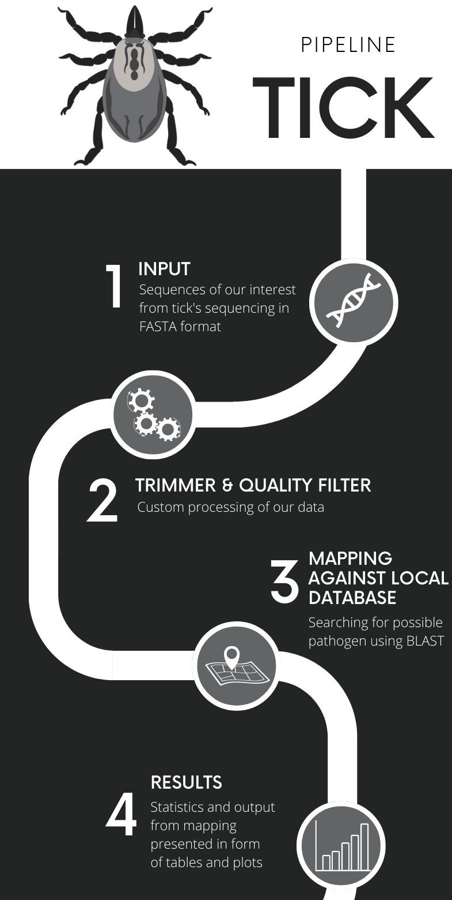

# TICK
This project is a "TICK" - a tool for analysis tick-borne pathogenes sequences. It is a GUI-based application to run BLAST (Basic Local Alignment Search Tool) in order to align possible tick-borne pathogenes' sequences to records from our self-created local database or online database limited to the pathogens we have indicated. It has additional features like sequence trimming, displaying BLAST results, and creating dot plots for alignment comparisons. This tool is designed for researchers and laboratory technicians who are working with tick pathogen sequences. This is our project for the "Architecture of large projects in bioinformatics" course.

Here we present TICK pipeline:




## Table of Contents

- [Prerequisites](#prerequisites)
- [Installation](#installation)
- [Configuration](#configuration)
- [Usage](#usage)
- [License](#license)
- [Acknowledgements](#acknowledgements)
- [Team](#team)

## Prerequisites

- Python 3.6 or higher
- BioPython
- NumPy
- Pillow
- Matplotlib
- BLAST command line tool
- Tkinter

## Installation

1. Clone this repository:

```sh
git clone https://github.com/bryzka/TICK.git
cd TICK
```

2. Install the required Python libraries:

```sh
pip install biopython numpy Pillow matplotlib
```

3. Download and install the BLAST command line tools from the [NCBI website](https://www.ncbi.nlm.nih.gov/books/NBK279671/).

## Configuration

1. Modify the `config` file to specify the paths to your BLAST binaries and database. Example:

```
[PATHS_req]
BLAST = /path/to/ncbi-blast-2.14.0+/bin
DATABASE_PATH = /path/to/local_database.fasta
ORGS = /path/to/list_of_pathogenes.txt

[PATHS_opt]
TMHMM = ...
SIGNALP = ...
EMBOSS = ...
SEG = ...
PFAM = ...
PFAM_db = ...
```

2. Add the path to the `config` file as an argument when running the main script.

## Usage

To use TICK, run the TICK.py script through your command line or terminal. Below is the detailed explanation of the command:
```
usage: TICK.py [-h] [--createdb] [--web] config
```
Positional Arguments:
* config: This argument is used to specify the path to the configuration file that contains settings for TICK. The configuration file includes the paths to the BLAST binaries, the local database, and a list of tick pathogens.

Optional Arguments:
* -h, --help: Use this flag to display a help message that provides a brief overview of how the command should be used and a list of available arguments.

* --createdb Run this flag if you want the application to create a BLAST database before running.
*  --web, -w Run this flag if you want to use the online version of BLAST instead of a local installation.

Examples:
To run the TICK tool with a configuration file and without creating a database:

```sh
python3 TICK.py /path/to/your/config/file
```
To run the TICK tool with a configuration file and create a database:

```sh
python3 TICK.py --createdb /path/to/your/config/file
```
After executing the command, a Tkinter GUI window will be launched. You can use this graphical interface to:

* Select a sequence file (in FASTA format) that you want to analyze.
* Choose whether you want to trim the sequence and specify the number of bases to trim from the start and end.
* Perform a BLAST search to identify similar sequences within a database.
* View the alignments and understand how the sequences are related.
* Generate dot plots for visual representation of alignments.

## License

This project is licensed under the terms of the MIT license.

## Acknowledgements

Thanks to the The National Center for Biotechnology Information (NCBI) for BLAST, The BioPython community for providing libraries, open-source community and prof. dr hab. Anna Bajer for providing some example sequences and making this project possible.

# Team
Julia Byrska, Stanisław Janik
